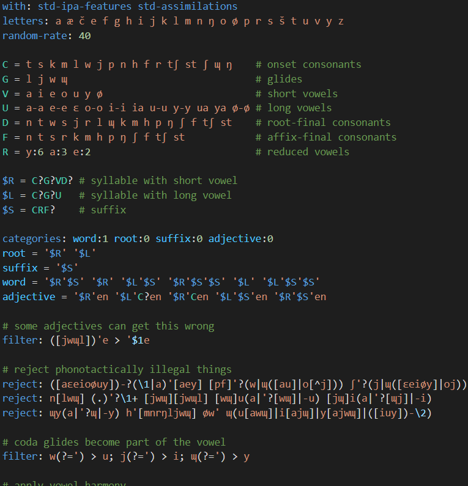

# Lexifer Definitions

This extension provides syntax highlighting and semantic highlighting; and "go to
definition", "go to references", and "rename symbol" actions for Lexifer
definition files.

## Known Issues

`\{` followed by a number colors the number as if the backslash were not there.

"Rename Symbol" with a macro that is not exactly two characters, a category
name that has uppercase letters or certain symbols, or a class name that is not
an uppercase letter, is a bit unreliable.

## Release Notes

Below is an abridged changelog.

### v0.1

This version was used during initial development and is not available to the
public.
