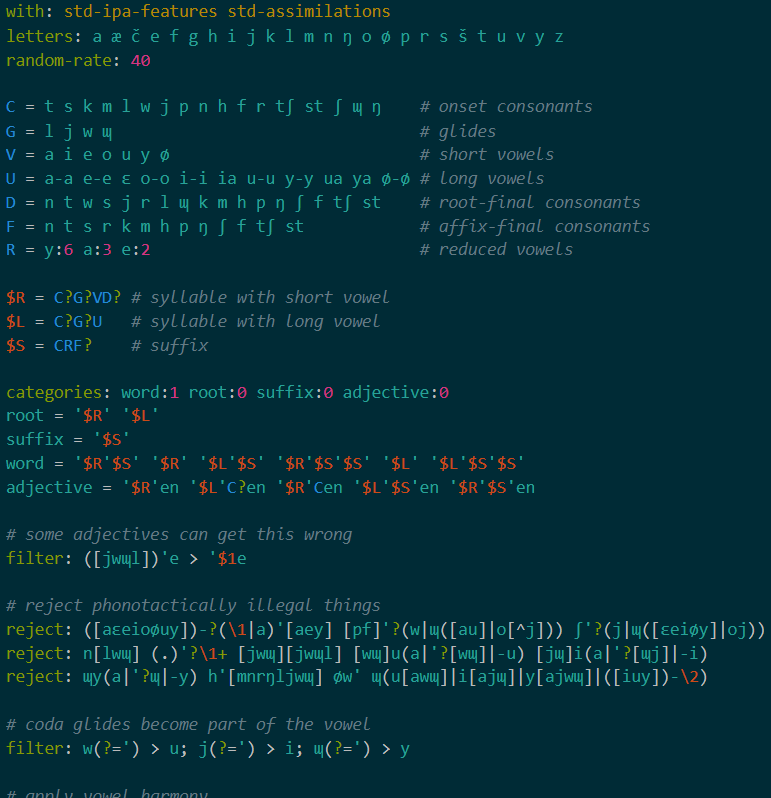

# lexiferdef

This extension provides syntax highlighting for Lexifer definitions.

## Known Issues

Non-ASCII capital letters are not recognized as class names.

Only two-character macro names are highlighted correctly.

`\{` followed by a number colors the number as if the backslash were not there.

## Release Notes

Below is an abridged changelog.

### v0.1

This version was used during initial development and is not available to the
public.
